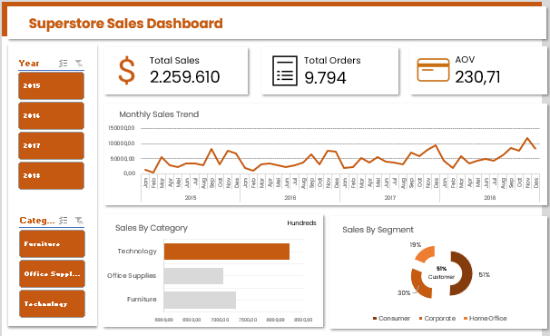

# 📊 Superstore Sales Analysis
Data analysis &amp; dashboard using Superstore dataset

## 📌 Project Overview
This project analyzes sales data from a retail dataset to uncover insights and trends.

## 🎯 Business Questions
- How are sales trends over time?
- Which category has the highest sales?
- Which segment contributes the most?

## 📈 Key Insights
- Technology has the highest sales among categories.
- Consumer segment dominates across all categories.
- Sales show a steady upward trend over time.

## 🛠 Tools Used
- Excel

## 📂 Dataset
Superstore Sales Dataset (Kaggle)

## 📊 Dashboard Preview

## 🚀 Conclusion
This project helps understand business performance and supports data-driven decision making.
